# EF Core Migration and Database Indexing Plan

## Overview
This plan outlines the strategy to create EF Core migrations for remaining tables and implement database indexing for optimal query performance.

---

## Tables Already Created
Based on user confirmation, the following tables are already in the database:
1. `Users` (UserDb)
2. `Roles` (RoleDb)
3. `UserKycs` (UserKycDb)
4. `Status` (GenericStatusDb)

---

## Tables Needing Migration (21 tables)

### Master Data Tables
| # | Table | Model | Key Indexes | Foreign Keys |
|---|-------|-------|-------------|--------------|
| 1 | warehouse | WarehouseDb | Id (PK), Name | ManagerId → Users, StatusId → Status |
| 2 | supplier | SupplierDb | Id (PK), GSTNumber (Unique), Email(unique) | StatusId → Status |
| 3 | stone | StoneDb | Id (PK), Name(unique) | StatusId → Status |
| 4 | metal | MetalDb | Id (PK), Name (Unique) | StatusId → Status |
| 5 | purity | PurityDb | Id (PK), MetalId+Name (Unique) | MetalId → Metal, StatusId → Status |
| 6 | category | CategoryDb | Id (PK), Name, ParentId | ParentId → Category |

### Inventory Tables
| # | Table | Model | Key Indexes | Foreign Keys |
|---|-------|-------|-------------|--------------|
| 7 | jewellery_item | JewelleryItemDb | Id (PK), ItemCode (Unique), CategoryId, StoneId | CategoryId → Category, StoneId → Stone, StatusId → Status |
| 8 | item_metal | ItemMetalDb | Id (PK), JewelleryItemId, MetalId+PurityId | JewelleryItemId → JewelleryItem, MetalId → Metal, PurityId → Purity, StatusId → Status |
| 9 | item_stone | ItemStoneDb | Id (PK), ItemId, StoneId | ItemId → JewelleryItem, StoneId → Stone, StatusId → Status |
| 10 | item_stock | ItemStockDb | Id (PK), JewelleryItemId+WarehouseId (Unique) | JewelleryItemId → JewelleryItem, WarehouseId → Warehouse, StatusId → Status |

### Purchase Tables
| # | Table | Model | Key Indexes | Foreign Keys |
|---|-------|-------|-------------|--------------|
| 11 | purchase_order | PurchaseOrderDb | Id (PK), OrderNumber (Unique), SupplierId, OrderDate | SupplierId → Supplier, StatusId → Status |
| 12 | PurchaseOrderItemDB | PurchaseOrderItemDb | Id (PK), PurchaseOrderId, JewelleryItemId | PurchaseOrderId → PurchaseOrder, JewelleryItemId → JewelleryItem, StatusId → Status |

### Sales Tables
| # | Table | Model | Key Indexes | Foreign Keys |
|---|-------|-------|-------------|--------------|
| 13 | sale_order | SaleOrderDb | Id (PK), OrderNumber (Unique), CustomerId, OrderDate | CustomerId → Users, StatusId → Status |
| 14 | sale_order_item | SaleOrderItemDb | Id (PK), SaleOrderId, JewelleryItemId | SaleOrderId → SaleOrder, JewelleryItemId → JewelleryItem, StatusId → Status |

### Rate History Tables
| # | Table | Model | Key Indexes | Foreign Keys |
|---|-------|-------|-------------|--------------|
| 15 | metal_rate_history | MetalRateHistoryDb | Id (PK), PurityId, EffectiveDate | PurityId → Purity, StatusId → Status |
| 16 | stone_rate_history | StoneRateHistoryDb | Id (PK), StoneId, EffectiveDate, StoneId+Carat+Color+Clarity (Unique) | StoneId → Stone, StatusId → Status |

### Transaction Tables
| # | Table | Model | Key Indexes | Foreign Keys |
|---|-------|-------|-------------|--------------|
| 17 | payment | PaymentDb | Id (PK), OrderId+OrderType (Index), PaymentDate, CustomerId, SalesPersonId | StatusId → Status, CustomerId → Users (Customer), SalesPersonId → Users (SalesPerson) |
| 18 | inventory_transaction | InventoryTransactionDb | Id (PK), JewelleryItemId, WarehouseId, TransactionDate, ReferenceId+ReferenceType | JewelleryItemId → JewelleryItem, WarehouseId → Warehouse, StatusId → Status |

### Exchange Tables
| # | Table | Model | Key Indexes | Foreign Keys |
|---|-------|-------|-------------|--------------|
| 19 | exchange_order | ExchangeOrderDb | Id (PK), OrderNumber (Unique), CustomerId, ExchangeDate | CustomerId → Users, StatusId → Status |
| 20 | exchange_item | ExchangeItemDb | Id (PK), ExchangeOrderId, MetalId+PurityId | ExchangeOrderId → ExchangeOrder, MetalId → Metal, PurityId → Purity, StatusId → Status |

### Invoice Tables
| # | Table | Model | Key Indexes | Foreign Keys |
|---|-------|-------|-------------|--------------|
| 21 | invoice | InvoiceDb | Id (PK), InvoiceNumber (Unique), CustomerId, SaleOrderId, InvoiceDate | StatusId → Status |
| 22 | invoice_item | InvoiceItemDb | Id (PK), InvoiceId | InvoiceId → Invoice |
| 23 | invoice_payment | InvoicePaymentDb | Id (PK), InvoiceId, PaymentId | InvoiceId → Invoice |

---

## Recommended Database Indexing Strategy

### High-Priority Indexes (Frequently Queried Columns)

#### Master Data Tables
```sql
-- Warehouse
CREATE INDEX IX_warehouse_name ON warehouse(name);
CREATE INDEX IX_warehouse_status ON warehouse(status_id);

-- Supplier
CREATE UNIQUE INDEX IX_supplier_gst ON supplier(gst_number);
CREATE INDEX IX_supplier_name ON supplier(name);
CREATE INDEX IX_supplier_status ON supplier(status_id);

-- Stone
CREATE INDEX IX_stone_name ON stone(name);
CREATE INDEX IX_stone_status ON stone(status_id);

-- Metal
CREATE UNIQUE INDEX IX_metal_name ON metal(name);
CREATE INDEX IX_metal_status ON metal(status_id);

-- Purity
CREATE UNIQUE INDEX IX_purity_metal_name ON purity(metal_id, name);
CREATE INDEX IX_purity_status ON purity(status_id);

-- Category
CREATE INDEX IX_category_name ON category(name);
CREATE INDEX IX_category_parent ON category(parent_id);
CREATE INDEX IX_category_active ON category(is_active);
```

#### Inventory Tables
```sql
-- Jewellery Item
CREATE UNIQUE INDEX IX_jewellery_item_code ON jewellery_item(item_code);
CREATE INDEX IX_jewellery_item_category ON jewellery_item(category_id);
CREATE INDEX IX_jewellery_item_stone ON jewellery_item(stone_id);
CREATE INDEX IX_jewellery_item_status ON jewellery_item(status_id);
CREATE INDEX IX_jewellery_item_name ON jewellery_item(name);

-- Item Metal
CREATE INDEX IX_item_metal_jewellery ON item_metal(jewellery_item_id);
CREATE INDEX IX_item_metal_metal ON item_metal(metal_id);
CREATE INDEX IX_item_metal_purity ON item_metal(purity_id);
CREATE INDEX IX_item_metal_status ON item_metal(status_id);

-- Item Stone
CREATE INDEX IX_item_stone_item ON item_stone(item_id);
CREATE INDEX IX_item_stone_stone ON item_stone(stone_id);
CREATE INDEX IX_item_stone_status ON item_stone(status_id);

-- Item Stock
CREATE UNIQUE INDEX IX_item_stock_jewellery_warehouse ON item_stock(jewellery_item_id, warehouse_id);
CREATE INDEX IX_item_stock_status ON item_stock(status_id);
CREATE INDEX IX_item_stock_quantity ON item_stock(quantity);
```

#### Purchase Order Tables
```sql
-- Purchase Order
CREATE UNIQUE INDEX IX_purchase_order_number ON purchase_order(order_number);
CREATE INDEX IX_purchase_order_supplier ON purchase_order(supplier_id);
CREATE INDEX IX_purchase_order_date ON purchase_order(order_date);
CREATE INDEX IX_purchase_order_status ON purchase_order(status_id);

-- Purchase Order Item
CREATE INDEX IX_purchase_order_item_po ON purchase_order_item(purchase_order_id);
CREATE INDEX IX_purchase_order_item_jewellery ON purchase_order_item(jewellery_item_id);
CREATE INDEX IX_purchase_order_item_status ON purchase_order_item(status_id);
```

#### Sale Order Tables
```sql
-- Sale Order
CREATE UNIQUE INDEX IX_sale_order_number ON sale_order(order_number);
CREATE INDEX IX_sale_order_customer ON sale_order(customer_id);
CREATE INDEX IX_sale_order_date ON sale_order(order_date);
CREATE INDEX IX_sale_order_status ON sale_order(status_id);

-- Sale Order Item
CREATE INDEX IX_sale_order_item_so ON sale_order_item(sale_order_id);
CREATE INDEX IX_sale_order_item_jewellery ON sale_order_item(jewellery_item_id);
CREATE INDEX IX_sale_order_item_status ON sale_order_item(status_id);
```

#### Rate History Tables
```sql
-- Metal Rate History
CREATE INDEX IX_metal_rate_purity ON metal_rate_history(purity_id);
CREATE INDEX IX_metal_rate_effective_date ON metal_rate_history(effective_date DESC);

-- Stone Rate History
CREATE UNIQUE INDEX IX_stone_rate_4cs ON stone_rate_history(stone_id, carat, color, clarity);
CREATE INDEX IX_stone_rate_stone ON stone_rate_history(stone_id);
CREATE INDEX IX_stone_rate_effective_date ON stone_rate_history(effective_date DESC);
```

#### Transaction Tables
```sql
-- Payment
CREATE INDEX IX_payment_order ON payment(order_id, order_type);
CREATE INDEX IX_payment_date ON payment(payment_date);
CREATE INDEX IX_payment_status ON payment(status_id);
CREATE INDEX IX_payment_customer ON payment(customer_id);
CREATE INDEX IX_payment_sales_person ON payment(sales_person_id);

-- Inventory Transaction
CREATE INDEX IX_inventory_transaction_jewellery ON inventory_transaction(jewellery_item_id);
CREATE INDEX IX_inventory_transaction_warehouse ON inventory_transaction(warehouse_id);
CREATE INDEX IX_inventory_transaction_date ON inventory_transaction(transaction_date);
CREATE INDEX IX_inventory_transaction_reference ON inventory_transaction(reference_id, reference_type);
CREATE INDEX IX_inventory_transaction_type ON inventory_transaction(transaction_type);
```

#### Exchange Tables
```sql
-- Exchange Order
CREATE UNIQUE INDEX IX_exchange_order_number ON exchange_order(order_number);
CREATE INDEX IX_exchange_order_customer ON exchange_order(customer_id);
CREATE INDEX IX_exchange_order_date ON exchange_order(exchange_date);
CREATE INDEX IX_exchange_order_status ON exchange_order(status_id);

-- Exchange Item
CREATE INDEX IX_exchange_item_order ON exchange_item(exchange_order_id);
CREATE INDEX IX_exchange_item_metal ON exchange_item(metal_id);
CREATE INDEX IX_exchange_item_purity ON exchange_item(purity_id);
CREATE INDEX IX_exchange_item_status ON exchange_item(status_id);
```

#### Invoice Tables
```sql
-- Invoice
CREATE UNIQUE INDEX IX_invoice_number ON invoice(invoice_number);
CREATE INDEX IX_invoice_customer ON invoice(customer_id);
CREATE INDEX IX_invoice_sale_order ON invoice(sale_order_id);
CREATE INDEX IX_invoice_date ON invoice(invoice_date);
CREATE INDEX IX_invoice_status ON invoice(status_id);

-- Invoice Item
CREATE INDEX IX_invoice_item_invoice ON invoice_item(invoice_id);

-- Invoice Payment
CREATE INDEX IX_invoice_payment_invoice ON invoice_payment(invoice_id);
```

---

## Implementation Steps

### Step 1: Review and Update AppDbContext
- Add `[Index]` annotations to models
- Add explicit `[ForeignKey]` relationships
- Configure unique constraints using `[Index(IsUnique = true)]`

### Step 2: Create EF Core Migration
```bash
dotnet ef migrations add CreateRemainingTables
```

### Step 3: Review Migration
- Verify all tables are included
- Verify indexes are created
- Verify foreign key relationships

### Step 4: Apply Migration to Database
```bash
dotnet ef database update
```

### Step 5: Verify Database Schema
- Check all tables are created
- Verify indexes exist
- Confirm foreign key constraints

---

## Mermaid Diagram: Table Relationships

```mermaid
erDiagram
    USER ||--o{ WAREHOUSE : manages
    USER ||--o{ SALE_ORDER : customer
    USER ||--o{ EXCHANGE_ORDER : customer
    GENERIC_STATUS ||--o{ WAREHOUSE : status
    GENERIC_STATUS ||--o{ SUPPLIER : status
    GENERIC_STATUS ||--o{ STONE : status
    GENERIC_STATUS ||--o{ METAL : status
    GENERIC_STATUS ||--o{ PURITY : status
    GENERIC_STATUS ||--o{ JEWELLERY_ITEM : status
    GENERIC_STATUS ||--o{ ITEM_METAL : status
    GENERIC_STATUS ||--o{ ITEM_STONE : status
    GENERIC_STATUS ||--o{ ITEM_STOCK : status
    GENERIC_STATUS ||--o{ PURCHASE_ORDER : status
    GENERIC_STATUS ||--o{ PURCHASE_ORDER_ITEM : status
    GENERIC_STATUS ||--o{ SALE_ORDER : status
    GENERIC_STATUS ||--o{ SALE_ORDER_ITEM : status
    GENERIC_STATUS ||--o{ PAYMENT : status
    GENERIC_STATUS ||--o{ INVENTORY_TRANSACTION : status
    GENERIC_STATUS ||--o{ METAL_RATE_HISTORY : status
    GENERIC_STATUS ||--o{ STONE_RATE_HISTORY : status
    GENERIC_STATUS ||--o{ EXCHANGE_ORDER : status
    GENERIC_STATUS ||--o{ EXCHANGE_ITEM : status
    GENERIC_STATUS ||--o{ INVOICE : status
    
    METAL ||--o{ PURITY : has
    METAL ||--o{ ITEM_METAL : contains
    METAL ||--o{ EXCHANGE_ITEM : exchange
    PURITY ||--o{ ITEM_METAL : has
    PURITY ||--o{ METAL_RATE_HISTORY : for
    PURITY ||--o{ EXCHANGE_ITEM : purity
    
    STONE ||--o{ JEWELLERY_ITEM : has
    STONE ||--o{ ITEM_STONE : contains
    STONE ||--o{ STONE_RATE_HISTORY : rate
    
    CATEGORY ||--o{ JEWELLERY_ITEM : category
    CATEGORY ||--o{ CATEGORY : parent
    
    JEWELLERY_ITEM ||--o{ ITEM_METAL : has
    JEWELLERY_ITEM ||--o{ ITEM_STONE : has
    JEWELLERY_ITEM ||--o{ ITEM_STOCK : stock
    JEWELLERY_ITEM ||--o{ PURCHASE_ORDER_ITEM : ordered
    JEWELLERY_ITEM ||--o{ SALE_ORDER_ITEM : sold
    JEWELLERY_ITEM ||--o{ INVENTORY_TRANSACTION : moved
    
    WAREHOUSE ||--o{ ITEM_STOCK : location
    WAREHOUSE ||--o{ INVENTORY_TRANSACTION : location
    
    SUPPLIER ||--o{ PURCHASE_ORDER : supplies
    
    PURCHASE_ORDER ||--o{ PURCHASE_ORDER_ITEM : contains
    
    SALE_ORDER ||--o{ SALE_ORDER_ITEM : contains
    SALE_ORDER ||--o{ INVOICE : invoices
    
    EXCHANGE_ORDER ||--o{ EXCHANGE_ITEM : contains
    
    INVOICE ||--o{ INVOICE_ITEM : contains
    INVOICE ||--o{ INVOICE_PAYMENT : payments
```



---

## Notes

1. **Migration Naming**: Use descriptive migration names (e.g., `CreateRemainingTables`)

2. **Index Strategy**:
   - Primary keys are automatically indexed
   - Foreign keys should be indexed for join performance
   - Unique constraints create automatic indexes
   - Date columns indexed for range queries
   - Status columns indexed for filtering

3. **Execution Order**:
   - Master data tables first (Warehouse, Supplier, Stone, Metal, Purity, Category)
   - Then inventory tables (JewelleryItem, ItemMetal, ItemStone, ItemStock)
   - Then transaction tables (PurchaseOrder, SaleOrder, Payment, etc.)

4. **Rollback Plan**:
   - Keep migration files for potential rollback
   - Document any manual SQL changes
