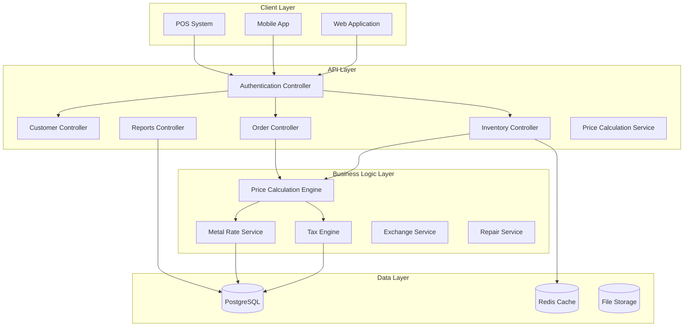

# Jewellery Inventory Management System - Comprehensive Enhancement Plan

## Executive Summary

This document outlines a comprehensive plan to enhance your current jewellery inventory management system from a basic CRUD application to a production-ready, industry-standard jewellery ERP system.

---

## Current System Assessment

### ✅ What's Already Implemented
- **Core Entities**: Users, Roles, Categories, Metals, Purity, Stones, JewelleryItems
- **Order Management**: PurchaseOrders, SaleOrders, Payments, InventoryTransactions
- **Inventory Tracking**: ItemStock management, Warehouse support
- **Technical Infrastructure**: JWT Authentication, FluentValidation, AutoMapper, PostgreSQL, NLog logging
- **API Layer**: RESTful controllers with Swagger documentation

### ⚠️ Critical Gaps Identified
1. No Customer Management (SaleOrder references non-existent Customer)
2. Missing ItemMetal CRUD (model exists but no service/controller)
3. No dynamic price calculation engine
4. No exchange/buyback functionality
5. No repair/job work management
6. No barcode/QR code generation
7. No comprehensive reporting/analytics
8. No stock alerts or reorder management
9. No audit trail logging
10. No tax (GST) calculation engine

---

## Phase 1: Core Data Models & User Enhancement

### 1.1 Customer as User (No Separate Customer Table)
**Strategy:** Use existing User table with Customer role
**Enhancements to User Model:**
```csharp
public class User {
    public long Id { get; set; }
    public string Name { get; set; }
    public string Email { get; set; }
    public string Password { get; set; }
    public string ContactNumber { get; set; }
    public int Gender { get; set; }
    public string? Address { get; set; }
    public string? City { get; set; }
    public string? State { get; set; }
    public string? PinCode { get; set; }
    public string? AadharNumber { get; set; }
    public string? PANNumber { get; set; }
    public DateOnly DOB { get; set; }
    public DateOnly? AnniversaryDate { get; set; }
    public decimal LoyaltyPoints { get; set; }
    public decimal? WalletBalance { get; set; }
    public string CustomerType { get; set; } = "Retail"; // Retail, Wholesale
    
    public int RoleId { get; set; }
    public int StatusId { get; set; }
    // ... audit fields
}
```

**Changes Required:**
1. Add Customer-specific fields to User model
2. Add migration for new columns
3. Create Customer-specific DTOs (UserCustomerDto.cs)
4. Add customer-specific endpoints to UserController
5. Filter users by Customer role when needed

**Benefits:**
- No duplicate data
- Unified authentication for customers
- Easier customer-to-user conversion
- Consistent data management

### 1.2 Complete ItemMetal Module
**Files to Create (if not exists):**
- `Repository/Interface/IItemMetalRepository.cs`
- `Repository/Implementation/ItemMetalRepository.cs`
- `Service/Interface/IItemMetalService.cs`
- `Service/Implementation/ItemMetalService.cs`
- `Controllers/ItemMetalController.cs`
- `Dto/ItemMetalDto.cs`
- `Validation/ItemMetalDtoValidator.cs`

### 1.3 Create Category Management
**Files to Create:**
- `Models/Category.cs` (already exists - verify)
- `Dto/CategoryDto.cs`
- `Validation/CategoryDtoValidator.cs`
- Add to Program.cs if missing

### 1.4 Data Models Enhancement
Add these missing entities:

**1.4.1 ExchangeOrder (Buyback/Exchange)**
```csharp
public class ExchangeOrder {
    public int Id { get; set; }
    public long CustomerId { get; set; }
    public string OrderNumber { get; set; }
    public DateTime OrderDate { get; set; }
    public decimal OldItemValue { get; set; } // Value of old jewellery
    public decimal NewItemValue { get; set; } // Value of new jewellery
    public decimal ExchangeDifference { get; set; } // Amount customer pays/receives
    public string ExchangeType { get; set; } // FULL_PARTIAL
    public int StatusId { get; set; }
    // ... audit fields
}
```

**1.4.2 RepairOrder**
```csharp
public class RepairOrder {
    public int Id { get; set; }
    public long CustomerId { get; set; }
    public string OrderNumber { get; set; }
    public DateTime ReceivedDate { get; set; }
    public DateTime? ExpectedDeliveryDate { get; set; }
    public DateTime? ActualDeliveryDate { get; set; }
    public string ItemDescription { get; set; }
    public string RepairType { get; set; } // RESIZING, POLISHING, etc.
    public decimal EstimatedCost { get; set; }
    public decimal ActualCost { get; set; }
    public string WorkStatus { get; set; } // RECEIVED, IN_PROGRESS, etc.
    public int StatusId { get; set; }
}
```

**1.4.3 HallmarkRecord**
```csharp
public class HallmarkRecord {
    public int Id { get; set; }
    public long JewelleryItemId { get; set; }
    public string BISHallmarkNumber { get; set; }
    public decimal Purity { get; set; }
    public DateTime HallmarkDate { get; set; }
    public string CertifyingBody { get; set; }
    public string? CertificatePath { get; set; }
    public int StatusId { get; set; }
}
```

**1.4.4 StoneRateHistory**
```csharp
public class StoneRateHistory {
    public int Id { get; set; }
    public int StoneId { get; set; }
    public string StoneType { get; set; } // DIAMOND, COLOR_STONE, etc.
    public string Grade { get; set; } // IF, VVS1, etc.
    public decimal RatePerCarat { get; set; }
    public DateTime EffectiveDate { get; set; }
    public int StatusId { get; set; }
}
```

---

## Phase 2: Business Logic Engines

### 2.1 Price Calculation Engine
**Service:** `IPriceCalculationService`

**Key Methods:**
```csharp
public class PriceCalculationResult {
    public decimal MetalWeight { get; set; }
    public decimal MetalRate { get; set; }
    public decimal MetalValue { get; set; }
    public decimal StoneWeight { get; set; }
    public decimal StoneRate { get; set; }
    public decimal StoneValue { get; set; }
    public decimal MakingCharges { get; set; }
    public decimal WastagePercentage { get; set; }
    public decimal WastageValue { get; set; }
    public decimal SubTotal { get; set; }
    public decimal Discount { get; set; }
    public decimal TaxAmount { get; set; }
    public decimal FinalPrice { get; set; }
}

public interface IPriceCalculationService {
    PriceCalculationResult CalculatePrice(long jewelleryItemId, int purityId, int stoneId);
    PriceCalculationResult CalculatePrice(JewelleryItem item, int purityId, decimal currentGoldRate);
    decimal CalculateMakingCharges(string category, decimal weight);
    decimal CalculateWastage(string category, decimal weight, string purity);
}
```

**Calculation Formula:**
```
MetalValue = NetWeight × (PurityRate × RatePerGram)
StoneValue = StoneWeight × StoneRate
WastageValue = MetalValue × (WastagePercentage / 100)
MakingCharges = Fixed + (Weight × Rate)
SubTotal = MetalValue + StoneValue + WastageValue + M akingCharges
Tax = SubTotal × (TaxRate / 100)
FinalPrice = SubTotal - Discount + Tax
```

### 2.2 Tax Management Service (GST)
**Service:** `ITaxService`

**Features:**
- GST calculation (currently 3% for gold jewellery in India)
- HSN/SAC code management
- Tax exemption handling
- Tax reports by period

```csharp
public interface ITaxService {
    decimal GetGSTPercentage(DateTime date, string itemCategory);
    decimal CalculateGST(decimal taxableAmount, DateTime date);
    TaxReport GenerateTaxReport(DateTime startDate, DateTime endDate);
}
```

### 2.3 Metal Rate Service
**Service:** `IMetalRateService`

**Features:**
- Real-time gold rate updates
- Rate history tracking
- Rate alerts (SMS/Email notifications)
- Multi-metal support (Gold, Silver, Platinum)

```csharp
public interface IMetalRateService {
    decimal GetCurrentRate(int metalId, int purityId);
    void UpdateRate(int metalId, int purityId, decimal newRate);
    List<GoldRateHistory> GetRateHistory(int metalId, DateTime from, DateTime to);
    void SetRateAlert(int metalId, int purityId, decimal targetRate, string notificationType);
}
```

### 2.4 Stone Rate Service
**Service:** `IStoneRateService`

**Features:**
- Diamond rate by 4Cs (Carat, Cut, Color, Clarity)
- Colored stone rates
- Rate history
- Rate cards

### 2.5 Exchange/Buyback Service
**Service:** `IExchangeService`

**Features:**
- Old gold rate calculation (may differ from new gold rate)
- Exchange value calculation
- Making charge adjustment
- Exchange order management

```csharp
public interface IExchangeService {
    decimal CalculateExchangeValue(decimal weight, int purityId, decimal currentBuybackRate);
    ExchangeOrder CreateExchangeOrder(ExchangeOrderDto orderDto);
    void ProcessExchange(ExchangeOrder order);
}
```

### 2.6 Repair Service
**Service:** `IRepairService`

**Features:**
- Repair order creation
- Job work tracking
- Artisan/worker assignment
- Cost estimation
- Delivery management

---

## Phase 3: Operations Features

### 3.1 Barcode/QR Code Generation
**Service:** `IBarcodeService`

**Features:**
- Generate unique barcodes for each jewellery item
- QR code generation with item details
- Printable barcode labels
- Barcode scanning integration

```csharp
public interface IBarcodeService {
    string GenerateBarcode(long jewelleryItemId);
    byte[] GenerateBarcodeImage(string barcode);
    byte[] GenerateQRCode(JewelleryItem item);
    JewelleryItem GetItemByBarcode(string barcode);
}
```

**Barcode Format:**
```
Format: JJM-YYYY-NNNNNN
Example: JJM-2024-000123
- JJM: Company prefix
- YYYY: Year
- NNNNNN: Sequential number
```

### 3.2 Stock Alerts & Reorder Management
**Service:** `IStockAlertService`

**Features:**
- Low stock alerts
- Reorder level configuration
- Automated alerts via email/SMS
- Stock dashboard widgets

```csharp
public interface IStockAlertService {
    void CheckStockLevels();
    void CreateStockAlert(int itemId, string alertType, string message);
    List<StockAlert> GetActiveAlerts();
    void ConfigureReorderLevel(int categoryId, int minQuantity);
}
```

### 3.3 Audit Trail System
**Service:** `IAuditService`

**Features:**
- Log all data changes
- Track who made changes and when
- Store old and new values
- Query audit history

```csharp
public class AuditLog {
    public int Id { get; set; }
    public string EntityName { get; set; }
    public long EntityId { get; set; }
    public string Action { get; set; } // CREATE, UPDATE, DELETE
    public string? OldValues { get; set; } // JSON
    public string? NewValues { get; set; } // JSON
    public long UserId { get; set; }
    public DateTime Timestamp { get; set; }
    public string? IPAddress { get; set; }
}

public interface IAuditService {
    void Log(AuditLog log);
    List<AuditLog> GetAuditTrail(string entityName, long entityId);
    List<AuditLog> GetUserActivity(long userId, DateTime from, DateTime to);
}
```

### 3.4 Multi-Warehouse Management
**Features:**
- Warehouse-to-warehouse transfers
- Transfer orders
- Transfer history
- Current location tracking

**New Models:**
```csharp
public class StockTransfer {
    public int Id { get; set; }
    public string TransferNumber { get; set; }
    public int FromWarehouseId { get; set; }
    public int ToWarehouseId { get; set; }
    public DateTime TransferDate { get; set; }
    public string Status { get; set; }
    public int StatusId { get; set; }
}

public class StockTransferItem {
    public int Id { get; set; }
    public int TransferId { get; set; }
    public long JewelleryItemId { get; set; }
    public int Quantity { get; set; }
}
```

### 3.5 Item Reservation System
**Service:** `IReservationService`

**Features:**
- Reserve items for customers
- Reservation expiry
- Convert reservation to sale
- Cancellation handling

### 3.6 Serial Number Tracking
**Features:**
- Unique serial numbers for each item
- Track item lifecycle
- Warranty management
- Insurance tracking

---

## Phase 4: Reporting & Analytics

### 4.1 Dashboard Service
**Service:** `IDashboardService`

**Key Metrics:**
```csharp
public class DashboardMetrics {
    public decimal TodaySales { get; set; }
    public decimal MonthSales { get; set; }
    public int TodayOrders { get; set; }
    public int MonthOrders { get; set; }
    public int LowStockItems { get; set; }
    public decimal TotalInventoryValue { get; set; }
    public List<TopSellingItem> TopSellingItems { get; set; }
    public List<SalesByCategory> SalesByCategory { get; set; }
    public List<SalesByMetal> SalesByMetal { get; set; }
    public List<DailySalesTrend> SalesTrend { get; set; }
}
```

### 4.2 Inventory Reports
**Endpoints:**
- `GET /api/Reports/Inventory/Summary`
- `GET /api/Reports/Inventory/ByWarehouse`
- `GET /api/Reports/Inventory/ByCategory`
- `GET /api/Reports/Inventory/LowStock`
- `GET /api/Reports/Inventory/Valuation`
- `GET /api/Reports/Inventory/Movement`

### 4.3 Sales Reports
**Endpoints:**
- `GET /api/Reports/Sales/Daily`
- `GET /api/Reports/Sales/Monthly`
- `GET /api/Reports/Sales/ByCustomer`
- `GET /api/Reports/Sales/ByItem`
- `GET /api/Reports/Sales/ProfitMargin`
- `GET /api/Reports/Sales/ExchangeSummary`

### 4.4 Financial Reports
**Endpoints:**
- `GET /api/Reports/Financial/DailyCollection`
- `GET /api/Reports/Financial/GSTReport`
- `GET /api/Reports/Financial/ProfitLoss`
- `GET /api/Reports/Financial/BalanceSheet`

### 4.5 Export Functionality
**Service:** `IReportExportService`

**Formats:**
- PDF export
- Excel export
- CSV export
- Print-friendly HTML

---

## Phase 5: Infrastructure & Quality Assurance

### 5.1 API Documentation Enhancement
**Enhancements:**
- More detailed endpoint documentation
- Request/response examples
- Error code documentation
- Rate limiting information

### 5.2 Unit Testing
**Coverage Target:** 80%+
**Frameworks:**
- xUnit or NUnit for unit tests
- Moq for mocking
- FluentAssertions for assertions

**Test Categories:**
- Service layer tests
- Repository layer tests
- Validation tests
- Price calculation tests

### 5.3 API Versioning
**Strategy:** URL-based versioning
```
/api/v1/...
/api/v2/...
```

### 5.4 Performance Optimization
**Areas:**
- Database indexing
- Query optimization
- Caching layer (Redis/MemoryCache)
- Async operations

### 5.5 CI/CD Pipeline
**Stages:**
1. Build
2. Run unit tests
3. Static code analysis
4. Deploy to staging
5. Integration tests
6. Deploy to production

### 5.6 Logging Enhancement
**Improvements:**
- Structured logging (JSON format)
- Log correlation IDs
- Performance logging
- Error alerts

### 5.7 Security Enhancements
**Features:**
- API rate limiting
- IP whitelist/blacklist
- Data encryption at rest
- Input sanitization
- SQL injection prevention

---

## Implementation Priority Order (Revised Based on Priority)

### HIGH PRIORITY: Price Calculation Engine (Weeks 1-3)
1. **Price Calculation Engine** - Core business logic for jewellery pricing
2. **Tax (GST) Service** - Required for accurate price calculation
3. **Metal Rate Service** - Foundation for price calculations
4. **Stone Rate Service** - For items with stones
5. **Complete ItemMetal CRUD** - Required for price calculations

### MEDIUM PRIORITY: User Enhancement & Order Management (Weeks 4-6)
1. **Enhance User Model** - Add customer-specific fields (LoyaltyPoints, Wallet, etc.)
2. **Exchange/Buyback Service**
3. **Repair Order Management**
4. **Item Reservation System**

### LOWER PRIORITY: Operations & Reporting (Weeks 7-12)
1. Barcode/QR Generation
2. Audit Trail System
3. Stock Alerts
4. Multi-Warehouse Transfers
5. Reporting & Analytics Dashboard
6. Testing & Documentation

---

## Quick Start: Price Calculation Engine Implementation

### Step 1: Create Price Calculation Service
**Files to Create:**
- `Service/Interface/IPriceCalculationService.cs`
- `Service/Implementation/PriceCalculationService.cs`
- `Dto/PriceCalculationRequestDto.cs`
- `Dto/PriceCalculationResponseDto.cs`

### Step 2: Integrate with Sale/Purchase Orders
**Modify Existing Files:**
- `SaleOrderService.cs` - Use price calculation for order totals
- `PurchaseOrderService.cs` - Use price calculation for order totals
- `JewelleryItemService.cs` - Add price calculation endpoint

### Step 3: Create Tax Service
**Files to Create:**
- `Service/Interface/ITaxService.cs`
- `Service/Implementation/TaxService.cs`
- `Models/TaxConfig.cs`
- `Dto/TaxRateDto.cs`

### Step 4: Enhance Metal Rate Service
**Files to Create/Modify:**
- `Service/Interface/IMetalRateService.cs` (enhance)
- `Service/Implementation/MetalRateService.cs` (enhance)
- Add rate alert functionality

---

## Estimated New Files to Create

### Models (10 new files)
- Customer.cs
- ExchangeOrder.cs
- RepairOrder.cs
- HallmarkRecord.cs
- StoneRateHistory.cs
- StockTransfer.cs
- StockTransferItem.cs
- StockAlert.cs
- Reservation.cs
- AuditLog.cs

### DTOs (15+ new files)
- CustomerDto.cs
- CustomerAddressDto.cs
- CustomerSearchDto.cs
- ExchangeOrderDto.cs
- RepairOrderDto.cs
- HallmarkRecordDto.cs
- StoneRateHistoryDto.cs
- StockTransferDto.cs
- StockTransferItemDto.cs
- StockAlertDto.cs
- ReservationDto.cs
- DashboardMetricsDto.cs
- PriceCalculationDto.cs
- TaxReportDto.cs
- ReportFilterDto.cs

### Repositories (8 new files)
- ICustomerRepository.cs
- CustomerRepository.cs
- IExchangeOrderRepository.cs
- ExchangeOrderRepository.cs
- IRepairOrderRepository.cs
- RepairOrderRepository.cs
- IStockTransferRepository.cs
- StockTransferRepository.cs

### Services (12 new files)
- ICustomerService.cs
- CustomerService.cs
- IPriceCalculationService.cs
- PriceCalculationService.cs
- ITaxService.cs
- TaxService.cs
- IMetalRateService.cs
- MetalRateService.cs
- IBarcodeService.cs
- BarcodeService.cs
- IStockAlertService.cs
- StockAlertService.cs

### Controllers (8 new files)
- CustomerController.cs
- ExchangeOrderController.cs
- RepairOrderController.cs
- StockTransferController.cs
- ReportsController.cs
- DashboardController.cs
- HallmarkController.cs
- ReservationController.cs

---

## Technology Stack Additions

### NuGet Packages to Add
```
BarcodeLib (for barcode generation)
QRCoder (for QR code generation)
ClosedXML (for Excel export)
PdfSharpCore (for PDF generation)
StackExchange.Redis (for caching)
FluentEmail (for email notifications)
Polly (for resilience/retry)

### External Services Integration
- SMS Gateway (Twilio, MSG91)
- Email Service (SendGrid, SMTP)
- Payment Gateway (Razorpay, Stripe)
- Print Services (thermal printer integration)

---

## System Architecture Diagram



---

## Success Criteria

### Functional Requirements
- ✅ All CRUD operations working
- ✅ Dynamic price calculation accurate
- ✅ Customer management complete
- ✅ Multi-warehouse support
- ✅ Stock alerts functioning
- ✅ Reports generating correctly

### Non-Functional Requirements
- ⚡ API response time < 200ms
- 🔒 Security audit passed
- 📊 80%+ test coverage
- 📈 Scalable to 10x current load
- 📝 Complete documentation

---

## Next Steps

1. **Review and approve this plan**
2. **Prioritize phases based on business needs**
3. **Start with Phase 1: Customer Management**
4. **Set up CI/CD pipeline**
5. **Begin implementation in Code mode**

---

*Document Version: 1.0*
*Created: 2024-02-02*
