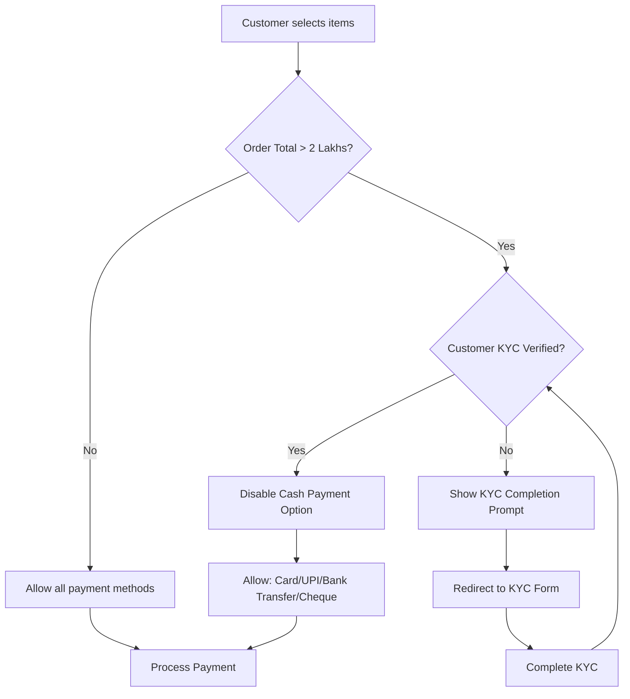
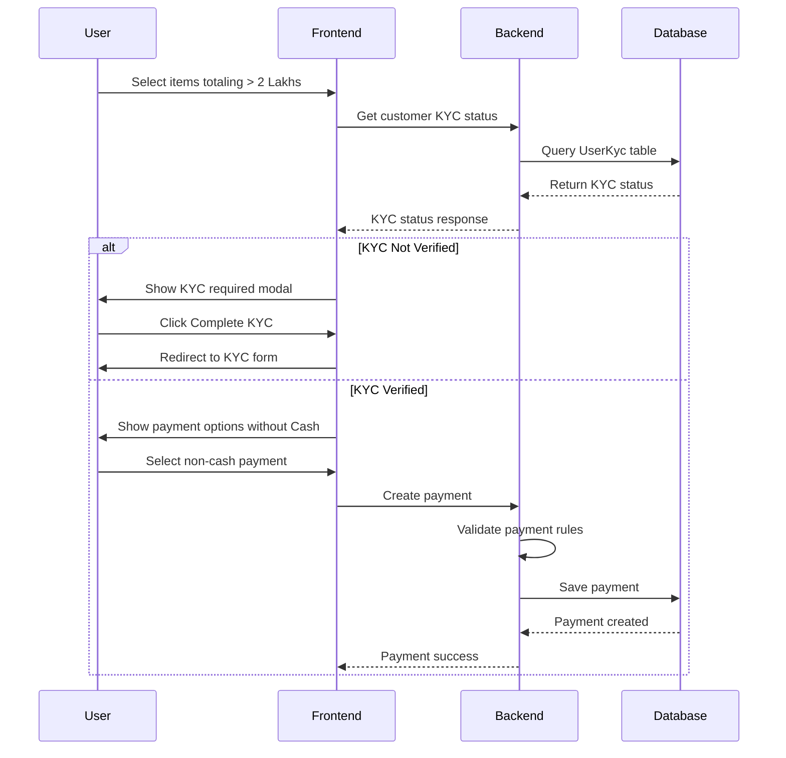

# High-Value Transaction KYC Validation Implementation Plan

## Business Requirement

When a customer makes a purchase above ₹2,00,000 (2 lakhs):
1. **Cash payment is NOT allowed** - Customer must use other payment methods (Card, UPI, Bank Transfer, Cheque)
2. **KYC must be completed** - Customer's UserKYC must be verified before proceeding
3. **Prompt for KYC completion** - If KYC is not completed, prompt the user to complete it

## Current System Analysis

### Existing Components

| Component | Location | Purpose |
|-----------|----------|---------|
| [`UserKyc`](InventoryManagementSystem/InventoryManagementSytem.Common/Models/UserKyc.cs) | Common Models | KYC entity with `IsVerified` flag |
| [`PaymentMethod`](InventoryManagementSystem/InventoryManagementSytem.Common/Enums/PaymentMethod.cs) | Enums | Payment methods: CASH, CARD, UPI, BANK_TRANSFER, CHEQUE |
| [`PaymentController`](InventoryManagementSystem/InventoryManagementSystem/Controllers/PaymentController.cs) | Controllers | Payment CRUD operations |
| [`PaymentService`](InventoryManagementSystem/InventoryManagementSystem.Service/Implementation/PaymentService.cs) | Service | Payment business logic |
| [`UserKycService`](InventoryManagementSystem/InventoryManagementSystem.Service/Implementation/UserKycService.cs) | Service | KYC operations |
| [`Step4PaymentComponent`](InventoryManagementSystemUI/angular/src/app/features/salewizard/steps/step4-payment/step4-payment.component.ts) | Angular | Payment step in sale wizard |
| [`SaleWizardService`](InventoryManagementSystemUI/angular/src/app/core/services/sale-wizard.service.ts) | Angular | Manages sale wizard state |

### Key Observations

1. **UserKyc Model** already has `IsVerified` boolean field to track KYC status
2. **PaymentMethod enum** has CASH as value 1
3. **Sale Wizard** manages order total in `orderTotal` property
4. **No current validation** exists for high-value transactions

---

## Implementation Architecture



---

## Implementation Details

### Phase 1: Backend Changes

#### 1.1 Add Business Rule Constants

Create a new constants file for business rules:

```csharp
// InventoryManagementSystem/InventoryManagementSytem.Common/Constants/BusinessRules.cs
namespace InventoryManagementSytem.Common.Constants
{
    public static class BusinessRules
    {
        // High-value transaction threshold: ₹2,00,000
        public const decimal HIGH_VALUE_TRANSACTION_THRESHOLD = 200000m;
        
        // Cash payment is not allowed for high-value transactions
        public const string CASH_PAYMENT_NOT_ALLOWED_MESSAGE = 
            "Cash payment is not allowed for transactions above ₹2,00,000. Please use Card, UPI, Bank Transfer, or Cheque.";
        
        // KYC required message
        public const string KYC_REQUIRED_MESSAGE = 
            "KYC verification is mandatory for transactions above ₹2,00,000. Please complete your KYC to proceed.";
    }
}
```

#### 1.2 Add KYC Validation Method in UserKycService

Add a new method to check if customer KYC is verified:

```csharp
// Add to IUserKycService interface
Task<bool> IsUserKycVerifiedAsync(long userId);

// Add to UserKycService implementation
public async Task<bool> IsUserKycVerifiedAsync(long userId)
{
    var userKyc = await _userKycRepository.GetUserKycByUserIdAsync(userId);
    return userKyc != null && userKyc.IsVerified;
}
```

#### 1.3 Create Payment Validation Service

Create a new validation service for payment business rules:

```csharp
// InventoryManagementSystem/InventoryManagementSystem.Service/Interface/IPaymentValidationService.cs
public interface IPaymentValidationService
{
    Task<PaymentValidationResult> ValidatePaymentAsync(
        long customerId, 
        decimal amount, 
        string paymentMethod, 
        decimal orderTotal);
}

public class PaymentValidationResult
{
    public bool IsValid { get; set; }
    public string ErrorCode { get; set; }
    public string ErrorMessage { get; set; }
    public bool RequiresKyc { get; set; }
    public bool CashPaymentDisabled { get; set; }
}
```

#### 1.4 Update PaymentController

Add validation before creating payment:

```csharp
[HttpPost]
public async Task<IActionResult> CreatePayment([FromBody] PaymentDto dto)
{
    // Validate high-value transaction rules
    var validation = await _paymentValidationService.ValidatePaymentAsync(
        dto.CustomerId ?? 0,
        dto.Amount,
        dto.PaymentMethod,
        dto.Amount // For single payment, amount equals order total
    );
    
    if (!validation.IsValid)
    {
        return BadRequest(new { 
            error = validation.ErrorCode,
            message = validation.ErrorMessage,
            requiresKyc = validation.RequiresKyc
        });
    }
    
    // Existing payment creation logic...
}
```

#### 1.5 Add API Endpoint for KYC Status Check

Add endpoint to check customer KYC status:

```csharp
// In UserKycController or create new CustomerKycController
[HttpGet("customer/{customerId}/status")]
public async Task<IActionResult> GetCustomerKycStatus(long customerId)
{
    var kycStatus = await _userKycService.GetUserKycByUserIdAsync(customerId);
    
    return Ok(new {
        hasKyc = kycStatus != null,
        isVerified = kycStatus?.IsVerified ?? false,
        panCardNumber = kycStatus?.PanCardNumber,
        aadhaarCardNumber = kycStatus?.AadhaarCardNumber?.Substring(0, 4) + "XXXX" // Masked
    });
}
```

---

### Phase 2: Frontend Changes

#### 2.1 Create KYC Status Service

```typescript
// InventoryManagementSystemUI/angular/src/app/core/services/kyc.service.ts
@Injectable({ providedIn: 'root' })
export class KycService {
    private apiUrl = `${environment.apiUrl}/UserKyc`;
    
    constructor(private http: HttpClient) {}
    
    getCustomerKycStatus(customerId: number): Observable<KycStatus> {
        return this.http.get<KycStatus>(`${this.apiUrl}/customer/${customerId}/status`);
    }
}

export interface KycStatus {
    hasKyc: boolean;
    isVerified: boolean;
    panCardNumber?: string;
    aadhaarCardNumber?: string;
}
```

#### 2.2 Update SaleWizardState Interface

Add KYC status to wizard state:

```typescript
export interface SaleWizardState {
    // ... existing properties
    
    // KYC Status for high-value transactions
    customerKycStatus: KycStatus | null;
    isHighValueTransaction: boolean;
    kycValidationRequired: boolean;
}
```

#### 2.3 Update Step4PaymentComponent

Add validation logic in payment step:

```typescript
// Constants
const HIGH_VALUE_THRESHOLD = 200000;

// Check if high-value transaction
isHighValueTransaction(): boolean {
    return this.wizardState.orderTotal > HIGH_VALUE_THRESHOLD;
}

// Check if KYC is required
isKycRequired(): boolean {
    return this.isHighValueTransaction() && 
           (!this.wizardState.customerKycStatus?.isVerified);
}

// Filter payment methods based on transaction value
getAvailablePaymentMethods(): PaymentMethodOption[] {
    if (this.isHighValueTransaction() && this.wizardState.customerKycStatus?.isVerified) {
        // Exclude cash for high-value transactions with verified KYC
        return this.paymentMethodOptions.filter(m => m.value !== PaymentMethod.CASH);
    }
    return this.paymentMethodOptions;
}

// Handle payment submission
onSubmit(): void {
    // Validate KYC for high-value transactions
    if (this.isKycRequired()) {
        this.showKycRequiredModal();
        return;
    }
    
    // Validate cash payment for high-value transactions
    const paymentMethod = this.paymentForm.get('paymentMethod')?.value;
    if (this.isHighValueTransaction() && paymentMethod === PaymentMethod.CASH) {
        this.toastr.error('Cash payment is not allowed for transactions above ₹2,00,000');
        return;
    }
    
    // Existing payment logic...
}
```

#### 2.4 Create KYC Required Modal Component

```typescript
// InventoryManagementSystemUI/angular/src/app/features/salewizard/components/kyc-required-modal.component.ts
@Component({
    selector: 'app-kyc-required-modal',
    template: `
        <div class="modal-header">
            <h5 class="modal-title">KYC Verification Required</h5>
        </div>
        <div class="modal-body">
            <div class="alert alert-warning">
                <strong>Transaction Amount:</strong> {{ orderTotal | currency:'INR' }}
            </div>
            <p>
                For transactions above ₹2,00,000, KYC verification is mandatory 
                as per regulatory requirements.
            </p>
            <p>
                Please complete your KYC verification to proceed with this purchase.
            </p>
        </div>
        <div class="modal-footer">
            <button type="button" class="btn btn-secondary" (click)="onCancel()">
                Cancel
            </button>
            <button type="button" class="btn btn-primary" (click)="onCompleteKyc()">
                Complete KYC Now
            </button>
        </div>
    `
})
export class KycRequiredModalComponent {
    @Input() orderTotal: number;
    @Input() customerId: number;
    
    constructor(
        private router: Router,
        private activeModal: NgbActiveModal
    ) {}
    
    onCompleteKyc(): void {
        this.activeModal.close();
        this.router.navigate(['/user-kyc/add'], {
            queryParams: { customerId: this.customerId }
        });
    }
    
    onCancel(): void {
        this.activeModal.dismiss();
    }
}
```

#### 2.5 Update Sale Wizard Service

Add KYC check when customer is selected:

```typescript
// In SaleWizardService
selectCustomer(customer: User): void {
    this.updateState({ 
        selectedCustomer: customer,
        isLoading: true 
    });
    
    // Check KYC status for the customer
    this.kycService.getCustomerKycStatus(customer.id).subscribe({
        next: (kycStatus) => {
            this.updateState({
                customerKycStatus: kycStatus,
                isLoading: false
            });
        },
        error: () => {
            this.updateState({
                customerKycStatus: { hasKyc: false, isVerified: false },
                isLoading: false
            });
        }
    });
}

// Check if transaction is high-value
checkHighValueTransaction(): void {
    const state = this.getCurrentState();
    const isHighValue = state.orderTotal > HIGH_VALUE_THRESHOLD;
    
    this.updateState({
        isHighValueTransaction: isHighValue,
        kycValidationRequired: isHighValue && !state.customerKycStatus?.isVerified
    });
}
```

---

## Validation Flow Diagram



---

## Edge Cases to Handle

| Scenario | Expected Behavior |
|----------|-------------------|
| Order exactly ₹2,00,000 | Cash allowed (threshold is > 2 lakhs) |
| Order ₹2,00,001 | Cash NOT allowed, KYC required |
| Multiple payments totaling > 2 lakhs | Each payment validated against order total |
| Customer has KYC but not verified | Treat as KYC not completed |
| Partial payment in cash, then order exceeds 2 lakhs | Validate on each payment attempt |
| Exchange order with net amount > 2 lakhs | Same validation applies |
| Guest customer (no account) | Cannot proceed without account and KYC |

---

## Configuration Options

Consider making the threshold configurable:

```csharp
// In appsettings.json
{
    "BusinessRules": {
        "HighValueTransactionThreshold": 200000,
        "EnableKycValidation": true
    }
}
```

---

## Testing Checklist

- [ ] Unit tests for PaymentValidationService
- [ ] Unit tests for UserKycService.IsUserKycVerifiedAsync
- [ ] Integration tests for PaymentController validation
- [ ] E2E tests for sale wizard flow with high-value transactions
- [ ] Test with order total exactly at threshold
- [ ] Test with order total just above threshold
- [ ] Test KYC verified customer flow
- [ ] Test KYC not verified customer flow
- [ ] Test cash payment blocking for high-value transactions
- [ ] Test non-cash payment acceptance for high-value transactions

---

## Files to Modify/Create

### Backend Files

| File | Action | Description |
|------|--------|-------------|
| `InventoryManagementSytem.Common/Constants/BusinessRules.cs` | Create | Business rule constants |
| `InventoryManagementSystem.Service/Interface/IPaymentValidationService.cs` | Create | Payment validation interface |
| `InventoryManagementSystem.Service/Implementation/PaymentValidationService.cs` | Create | Payment validation logic |
| `InventoryManagementSystem.Service/Interface/IUserKycService.cs` | Modify | Add IsUserKycVerifiedAsync method |
| `InventoryManagementSystem.Service/Implementation/UserKycService.cs` | Modify | Implement IsUserKycVerifiedAsync |
| `InventoryManagementSystem/Controllers/PaymentController.cs` | Modify | Add validation in CreatePayment |
| `InventoryManagementSystem/Controllers/UserKycController.cs` | Modify | Add GetCustomerKycStatus endpoint |
| `InventoryManagementSystem/Program.cs` | Modify | Register PaymentValidationService |

### Frontend Files

| File | Action | Description |
|------|--------|-------------|
| `src/app/core/services/kyc.service.ts` | Create | KYC status service |
| `src/app/core/models/kyc.model.ts` | Create | KYC status interface |
| `src/app/core/services/sale-wizard.service.ts` | Modify | Add KYC state management |
| `src/app/features/salewizard/steps/step4-payment/step4-payment.component.ts` | Modify | Add validation logic |
| `src/app/features/salewizard/steps/step4-payment/step4-payment.component.html` | Modify | Add KYC warning UI |
| `src/app/features/salewizard/components/kyc-required-modal.component.ts` | Create | KYC required modal |

---

## Summary

This implementation ensures:
1. **Compliance** - Meets regulatory requirements for high-value transactions
2. **User Experience** - Clear prompts guide users to complete KYC
3. **Security** - Backend validation prevents bypassing rules
4. **Maintainability** - Configurable thresholds and clear separation of concerns
