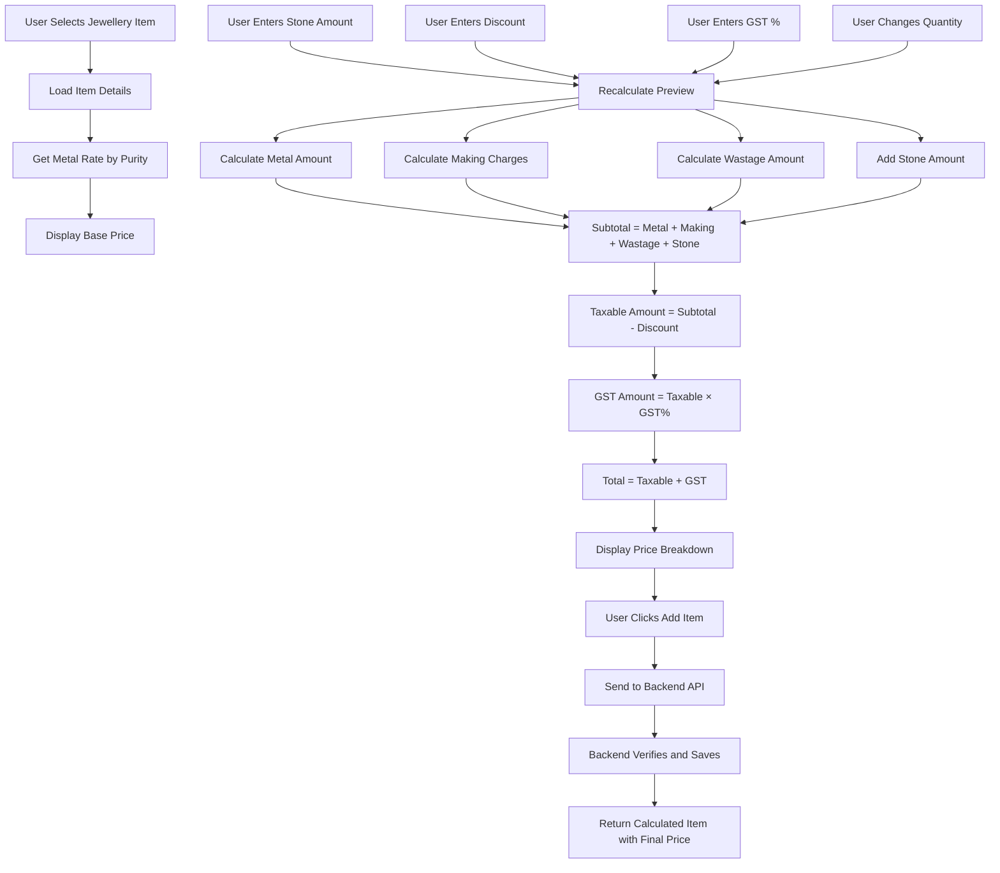

# Sale Wizard Step 3 - Price Calculation Fix Plan

## Problem Statement

In Step 3 of the Sale Wizard (Add Jewellery Items), the frontend is not displaying the complete price calculation to the user. Currently:

1. The frontend shows a base `sellingPrice` that only includes: Metal Amount + Making Charges + Wastage Charges
2. The user manually enters `stoneAmount` and `gstPercentage`
3. **The user does NOT see a preview of the final calculated total** before adding the item
4. The GST appears to be calculated only on stone rate (as per user observation), not on the complete item subtotal

## Current Implementation Analysis

### Backend (Already Correct)

The backend [`SaleOrderItemService.CreateSaleOrderItemWithCalculationAsync()`](InventoryManagementSystem/InventoryManagementSystem.Service/Implementation/SaleOrderItemService.cs:57) correctly calculates:

```
MetalAmount = NetMetalWeight × MetalRatePerGram
MakingCharges = Based on type (PerGram/Percentage/Fixed)
WastageAmount = WastageWeight × MetalRatePerGram
ItemSubtotal = MetalAmount + MakingCharges + WastageAmount + StoneAmount
TaxableAmount = ItemSubtotal - DiscountAmount
GstAmount = TaxableAmount × GstPercentage / 100
TotalAmount = TaxableAmount + GstAmount
```

### Frontend (Needs Enhancement)

The frontend [`saleorderitemform.ts`](InventoryManagementSystemUI/angular/src/app/features/saleorderitemmanagement/saleorderitemform/saleorderitemform.ts) has issues:

1. **Line 201-226**: `calculateSellingPrice()` only calculates base price without stone amount and GST
2. **Line 459-466**: Form submission sends data to backend correctly, but no preview is shown
3. **HTML Template**: No real-time price breakdown display

## Solution Approach

### Option A: Frontend Preview Calculation (Recommended)

Add a real-time price preview section in the form that calculates and displays:

1. **Metal Amount**: `NetWeight × Current Metal Rate (by purity)`
2. **Making Charges**: Based on making charge type
3. **Wastage Charges**: `WastageWeight × Metal Rate`
4. **Stone Amount**: User-entered value
5. **Subtotal**: Sum of above
6. **Discount**: User-entered value
7. **Taxable Amount**: Subtotal - Discount
8. **GST Amount**: Taxable Amount × GST%
9. **Total Amount**: Taxable Amount + GST

### Option B: Backend Preview Endpoint

Create a new backend endpoint `POST /api/SaleOrderItem/preview` that returns the calculated price without creating the item.

**Pros**: Accurate calculation matching backend logic
**Cons**: Additional API call, more network traffic

## Recommended Implementation: Option A with Backend Verification

Implement frontend preview calculation for real-time display, but rely on backend for final calculation when item is added.

### Files to Modify

#### 1. Frontend Component: [`saleorderitemform.ts`](InventoryManagementSystemUI/angular/src/app/features/saleorderitemmanagement/saleorderitemform/saleorderitemform.ts)

**Add properties for price breakdown:**
```typescript
// Price breakdown for display
priceBreakdown = {
  metalAmount: 0,
  makingCharges: 0,
  wastageAmount: 0,
  stoneAmount: 0,
  subtotal: 0,
  discountAmount: 0,
  taxableAmount: 0,
  gstAmount: 0,
  totalAmount: 0
};
```

**Add method to calculate price preview:**
```typescript
calculatePricePreview(): void {
  if (!this.selectedItem) return;
  
  const item = this.selectedItem;
  const stoneAmount = this.saleOrderItemForm.get('stoneAmount')?.value || 0;
  const discountAmount = this.saleOrderItemForm.get('discountAmount')?.value || 0;
  const gstPercentage = this.saleOrderItemForm.get('gstPercentage')?.value || 0;
  const quantity = this.saleOrderItemForm.get('quantity')?.value || 1;
  
  // Get metal rate from the item's selling price calculation
  const metalRate = item.sellingPrice / (item.netWeight || item.grossWeight);
  
  // Calculate components
  const metalAmount = (item.netWeight || item.grossWeight) * metalRate;
  
  let makingCharges = 0;
  switch (item.makingChargeType) {
    case 1: makingCharges = (item.netWeight || item.grossWeight) * item.makingChargeValue; break;
    case 2: makingCharges = metalAmount * (item.makingChargeValue / 100); break;
    case 3: makingCharges = item.makingChargeValue; break;
  }
  
  const wastageWeight = (item.netWeight || item.grossWeight) * (item.wastagePercentage / 100);
  const wastageAmount = wastageWeight * metalRate;
  
  const subtotal = metalAmount + makingCharges + wastageAmount + stoneAmount;
  const taxableAmount = Math.max(0, subtotal - discountAmount);
  const gstAmount = taxableAmount * (gstPercentage / 100);
  const totalAmount = taxableAmount + gstAmount;
  
  this.priceBreakdown = {
    metalAmount: metalAmount * quantity,
    makingCharges: makingCharges * quantity,
    wastageAmount: wastageAmount * quantity,
    stoneAmount: stoneAmount * quantity,
    subtotal: subtotal * quantity,
    discountAmount: discountAmount * quantity,
    taxableAmount: taxableAmount * quantity,
    gstAmount: gstAmount * quantity,
    totalAmount: totalAmount * quantity
  };
}
```

**Add value change listeners:**
```typescript
// In ngOnInit or setupPriceCalculation method
this.saleOrderItemForm.get('stoneAmount')?.valueChanges.subscribe(() => this.calculatePricePreview());
this.saleOrderItemForm.get('discountAmount')?.valueChanges.subscribe(() => this.calculatePricePreview());
this.saleOrderItemForm.get('gstPercentage')?.valueChanges.subscribe(() => this.calculatePricePreview());
this.saleOrderItemForm.get('quantity')?.valueChanges.subscribe(() => this.calculatePricePreview());
```

**Update `selectJewelleryItem()` method:**
```typescript
selectJewelleryItem(item: JewelleryItemWithDetails): void {
  this.selectedItem = item;
  this.searchQuery = item.itemCode || item.name;
  this.saleOrderItemForm.patchValue({ jewelleryItemId: item.id });
  this.filteredItems = [];
  this.checkStockAvailability();
  this.loadStockForItem(item.id);
  // Add this line
  this.calculatePricePreview();
}
```

#### 2. Frontend Template: [`saleorderitemform.html`](InventoryManagementSystemUI/angular/src/app/features/saleorderitemmanagement/saleorderitemform/saleorderitemform.html)

**Add price breakdown section after the form fields (around line 266):**

```html
<!-- Price Breakdown Preview -->
@if (selectedItem && priceBreakdown.totalAmount > 0) {
  <div class="col-12 mt-3">
    <h6 class="text-muted mb-3">
      <i class="material-icons-outlined me-1" style="font-size: 18px; vertical-align: middle;">calculate</i>
      Price Breakdown Preview
    </h6>
    <div class="card">
      <div class="card-body p-2">
        <table class="table table-sm table-borderless mb-0">
          <tbody>
            <tr>
              <td>Metal Amount ({{ selectedItem.netWeight }}g × Rate)</td>
              <td class="text-end">₹{{ priceBreakdown.metalAmount | number:'1.2-2' }}</td>
            </tr>
            <tr>
              <td>Making Charges</td>
              <td class="text-end">₹{{ priceBreakdown.makingCharges | number:'1.2-2' }}</td>
            </tr>
            <tr>
              <td>Wastage Charges ({{ selectedItem.wastagePercentage }}%)</td>
              <td class="text-end">₹{{ priceBreakdown.wastageAmount | number:'1.2-2' }}</td>
            </tr>
            <tr>
              <td>Stone Amount</td>
              <td class="text-end">₹{{ priceBreakdown.stoneAmount | number:'1.2-2' }}</td>
            </tr>
            <tr class="table-light">
              <td class="fw-bold">Subtotal</td>
              <td class="text-end fw-bold">₹{{ priceBreakdown.subtotal | number:'1.2-2' }}</td>
            </tr>
            <tr>
              <td>Discount</td>
              <td class="text-end text-danger">- ₹{{ priceBreakdown.discountAmount | number:'1.2-2' }}</td>
            </tr>
            <tr class="table-light">
              <td class="fw-bold">Taxable Amount</td>
              <td class="text-end fw-bold">₹{{ priceBreakdown.taxableAmount | number:'1.2-2' }}</td>
            </tr>
            <tr>
              <td>GST ({{ saleOrderItemForm.get('gstPercentage')?.value }}%)</td>
              <td class="text-end">₹{{ priceBreakdown.gstAmount | number:'1.2-2' }}</td>
            </tr>
            <tr class="table-success">
              <td class="fw-bold">Total Amount</td>
              <td class="text-end fw-bold text-success">₹{{ priceBreakdown.totalAmount | number:'1.2-2' }}</td>
            </tr>
          </tbody>
        </table>
      </div>
    </div>
  </div>
}
```

#### 3. Update [`clearSelectedItem()`](InventoryManagementSystemUI/angular/src/app/features/saleorderitemmanagement/saleorderitemform/saleorderitemform.ts:667) method:

```typescript
clearSelectedItem(): void {
  this.selectedItem = null;
  this.searchQuery = '';
  this.saleOrderItemForm.patchValue({ jewelleryItemId: null });
  this.stockAvailable = null;
  this.availableQuantity = 0;
  // Reset price breakdown
  this.priceBreakdown = {
    metalAmount: 0, makingCharges: 0, wastageAmount: 0, stoneAmount: 0,
    subtotal: 0, discountAmount: 0, taxableAmount: 0, gstAmount: 0, totalAmount: 0
  };
}
```

## Implementation Checklist

- [ ] Add `priceBreakdown` property to component
- [ ] Add `calculatePricePreview()` method
- [ ] Add value change listeners for form fields
- [ ] Update `selectJewelleryItem()` to trigger calculation
- [ ] Update `clearSelectedItem()` to reset breakdown
- [ ] Add price breakdown HTML template
- [ ] Test the calculation matches backend results
- [ ] Verify GST is calculated on full taxable amount (not just stone amount)

## Data Flow Diagram



## Testing Scenarios

1. **Basic Ring Sale**:
   - Weight: 6.0g
   - Purity: 22K (rate: ₹6,000/g)
   - Making: ₹500/g
   - Wastage: 5%
   - Stone: ₹10,000
   - GST: 3%
   
   Expected:
   - Metal: 6 × 6,000 = ₹36,000
   - Making: 6 × 500 = ₹3,000
   - Wastage: 0.3g × 6,000 = ₹1,800
   - Subtotal: ₹50,800
   - GST: ₹1,524
   - Total: ₹52,324

2. **Item Without Stone**:
   - Verify stone amount = 0
   - GST calculated on metal + making + wastage only

3. **With Discount**:
   - Verify discount reduces taxable amount
   - GST calculated on reduced amount

## Notes

- The backend already implements correct calculation - no backend changes needed
- Frontend preview is for display purposes only
- Final calculation always done by backend for accuracy
- Metal rates are fetched from `MetalRateHistory` table by purity
