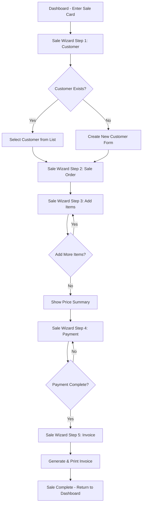

# Enter Sale Flow - Architecture Plan

## Overview

This document outlines the architecture for implementing the "Enter Sale" feature in the Jewellery Store Inventory Management System. This feature provides a streamlined wizard-style interface for completing sales from customer selection to invoice generation.

## Current System Analysis

### Existing Components

| Component | Location | Purpose |
|-----------|----------|---------|
| Dashboard | `src/app/demo/dashboard/` | Main analytics dashboard |
| User Management | `src/app/features/usermanagement/` | User CRUD with roleId=5 for Customers |
| Sale Order | `src/app/features/saleordermanagement/` | Sale order management |
| Sale Order Items | `src/app/features/saleorderitemmanagement/` | Items in sale orders |
| Invoice | `src/app/features/invoicemanagement/` | Invoice generation |
| Payment | `src/app/features/paymentmanagement/` | Payment processing |

### Key Models

- **User**: Customers are stored with `roleId = 5` (Customer role)
- **SaleOrder**: Links to customer via `customerId`
- **SaleOrderItem**: Individual items in a sale order with pricing
- **Invoice**: Generated from sale order
- **Payment**: Payment records linked to orders

## Proposed Architecture

### Flow Diagram



### Component Structure

```
src/app/features/salewizard/
├── salewizard.module.ts           # Module definition
├── salewizard.routes.ts           # Routing configuration
├── salewizard.component.ts        # Main wizard container
├── salewizard.component.html      # Wizard template with stepper
├── salewizard.component.scss      # Wizard styles
├── salewizard.service.ts          # State management service
├── steps/
│   ├── step1-customer/
│   │   ├── step1-customer.component.ts
│   │   ├── step1-customer.component.html
│   │   └── step1-customer.component.scss
│   ├── step2-saleorder/
│   │   ├── step2-saleorder.component.ts
│   │   ├── step2-saleorder.component.html
│   │   └── step2-saleorder.component.scss
│   ├── step3-items/
│   │   ├── step3-items.component.ts
│   │   ├── step3-items.component.html
│   │   └── step3-items.component.scss
│   ├── step4-payment/
│   │   ├── step4-payment.component.ts
│   │   ├── step4-payment.component.html
│   │   └── step4-payment.component.scss
│   └── step5-invoice/
│       ├── step5-invoice.component.ts
│       ├── step5-invoice.component.html
│       └── step5-invoice.component.scss
└── components/
    ├── customer-search/
    │   ├── customer-search.component.ts
    │   └── customer-search.component.html
    ├── customer-create-dialog/
    │   ├── customer-create-dialog.component.ts
    │   └── customer-create-dialog.component.html
    ├── item-selector/
    │   ├── item-selector.component.ts
    │   └── item-selector.component.html
    └── price-summary/
        ├── price-summary.component.ts
        └── price-summary.component.html
```

## Detailed Step Specifications

### Step 1: Customer Selection/Creation

**Purpose**: Identify or create the customer for the sale

**Features**:
- Search existing customers by phone number or name
- Display search results in a selectable list
- Create new customer dialog if customer not found
- Pre-fill customer information for new customers

**API Calls**:
- `UserService.getAllUsers()` - Filter by roleId=5 for customers
- `UserService.registerUser()` - Create new customer

**Form Fields for New Customer**:
| Field | Type | Required | Validation |
|-------|------|----------|------------|
| name | string | Yes | Min 2 chars |
| email | string | No | Email format |
| contactNumber | string | Yes | 10 digits |
| address | string | No | - |
| gender | enum | Yes | Male/Female/Other |
| dob | date | No | Valid date |

### Step 2: Sale Order Form

**Purpose**: Create the sale order header

**Features**:
- Auto-populate customer information (read-only)
- Set order date (default: today)
- Optional delivery date
- Exchange sale toggle
- Link to existing exchange order if applicable

**API Calls**:
- `SaleOrderService.createSaleOrder()` - Create sale order

**Form Fields**:
| Field | Type | Required | Default |
|-------|------|----------|---------|
| customerId | number | Yes | From Step 1 |
| orderDate | date | Yes | Today |
| deliveryDate | date | No | - |
| isExchangeSale | boolean | No | false |
| exchangeOrderId | number | Conditional | - |

### Step 3: Sale Order Items

**Purpose**: Add items to the sale order

**Features**:
- Search/select jewellery items from inventory
- Display item details (code, name, metal, weight, price)
- Set quantity with stock validation
- Apply discounts per item
- Automatic price calculation
- Running total display
- Add multiple items
- Remove items from order

**API Calls**:
- `ItemStockService.getItemStockByJewelleryItemId()` - Check stock
- `JewelleryItemService.getJewelleryItemById()` - Get item details
- `SaleOrderItemService.createSaleOrderItemWithCalculation()` - Add item

**Price Calculation Display**:
| Component | Description |
|-----------|-------------|
| Metal Amount | Weight × Rate per gram |
| Making Charges | Based on charge type |
| Stone Amount | If applicable |
| Subtotal | Sum of above |
| Discount | Applied discount |
| GST | Tax calculation |
| **Total** | Final item amount |

### Step 4: Payment Processing

**Purpose**: Record payment for the sale

**Features**:
- Display order total amount
- Multiple payment method support
- Split payment capability
- Payment reference tracking
- Balance calculation
- Partial payment handling

**API Calls**:
- `PaymentService.createPayment()` - Record payment

**Payment Methods**:
| Method | Code | Reference Required |
|--------|------|-------------------|
| Cash | 1 | No |
| Card | 2 | Yes (Transaction ID) |
| UPI | 3 | Yes (UPI Transaction ID) |
| Bank Transfer | 4 | Yes (Reference Number) |
| Cheque | 5 | Yes (Cheque Number) |

**Form Fields**:
| Field | Type | Required |
|-------|------|----------|
| amount | number | Yes |
| paymentMethod | enum | Yes |
| paymentDate | date | Yes |
| referenceNumber | string | Conditional |

### Step 5: Invoice Generation

**Purpose**: Generate and display the final invoice

**Features**:
- Preview invoice before generation
- Auto-populate all sale details
- Company and customer information
- Item-wise breakdown
- Tax summary
- Terms and conditions
- Print/Download options
- E-invoice generation (if applicable)

**API Calls**:
- `InvoiceService.generateInvoice()` - Generate invoice
- `InvoiceService.getInvoiceByNumber()` - Retrieve for display

**Invoice Contents**:
- Invoice number and date
- Company details (name, address, GSTIN, etc.)
- Customer details (name, address, phone, GSTIN if available)
- Sale order reference
- Item details with HSN codes
- Price breakdown (subtotal, discounts, GST, total)
- Payment summary
- Terms and conditions
- QR code for e-invoice

## State Management

### SaleWizardService

A dedicated service to manage wizard state across steps:

```typescript
interface SaleWizardState {
  // Step 1
  selectedCustomer: User | null;
  isNewCustomer: boolean;
  
  // Step 2
  saleOrder: SaleOrder | null;
  
  // Step 3
  saleOrderItems: SaleOrderItem[];
  orderTotal: number;
  
  // Step 4
  payments: Payment[];
  totalPaid: number;
  balanceDue: number;
  
  // Step 5
  generatedInvoice: Invoice | null;
  
  // Navigation
  currentStep: number;
  completedSteps: number[];
}
```

### Service Methods

| Method | Purpose |
|--------|---------|
| `resetWizard()` | Clear all state |
| `setCustomer(customer: User)` | Set selected customer |
| `createCustomer(data: UserCreate)` | Create new customer |
| `setSaleOrder(order: SaleOrder)` | Set sale order |
| `addItem(item: SaleOrderItem)` | Add item to order |
| `removeItem(itemId: number)` | Remove item |
| `addPayment(payment: Payment)` | Add payment |
| `setInvoice(invoice: Invoice)` | Set generated invoice |
| `nextStep()` | Move to next step |
| `previousStep()` | Move to previous step |
| `canProceed(): boolean` | Validate current step |

## Routing Configuration

```typescript
const routes: Routes = [
  {
    path: 'sale-wizard',
    component: SaleWizardComponent,
    canActivate: [authGuard],
    children: [
      { path: '', redirectTo: 'customer', pathMatch: 'full' },
      { path: 'customer', component: Step1CustomerComponent },
      { path: 'order', component: Step2SaleorderComponent },
      { path: 'items', component: Step3ItemsComponent },
      { path: 'payment', component: Step4PaymentComponent },
      { path: 'invoice', component: Step5InvoiceComponent },
    ]
  }
];
```

## Dashboard Integration

### Enter Sale Card

Add a prominent card to the dashboard:

```html
<div class="col-xl-3 col-md-6">
  <div class="card bg-primary text-white enter-sale-card" routerLink="/jewelleryManagement/admin/sale-wizard">
    <div class="card-body">
      <div class="d-flex align-items-center">
        <div class="avatar-lg me-3">
          <i class="material-icons-outlined fs-1">point_of_sale</i>
        </div>
        <div>
          <h5 class="mb-1">Enter Sale</h5>
          <small>Start a new sale transaction</small>
        </div>
      </div>
    </div>
  </div>
</div>
```

## UI/UX Considerations

### Stepper Component

Use Angular Material or ng-bootstrap stepper for:
- Visual progress indicator
- Step navigation
- Validation before proceeding
- Linear vs non-linear modes

### Responsive Design

- Mobile-friendly forms
- Touch-friendly controls
- Readable text at all screen sizes
- Collapsible sections for small screens

### Loading States

- Skeleton loaders for data fetching
- Progress indicators for API calls
- Disabled states during submission

### Error Handling

- Inline validation messages
- Toast notifications for errors
- Retry mechanisms for failed API calls
- Graceful degradation

## Implementation Order

1. **Phase 1: Foundation**
   - Create SaleWizard module and routing
   - Implement SaleWizardService for state management
   - Create main wizard container with stepper

2. **Phase 2: Customer Step**
   - Customer search component
   - Customer create dialog
   - Integration with UserService

3. **Phase 3: Sale Order Step**
   - Sale order form
   - Integration with SaleOrderService

4. **Phase 4: Items Step**
   - Item selector component
   - Price summary component
   - Integration with SaleOrderItemService

5. **Phase 5: Payment Step**
   - Payment form
   - Multiple payment support
   - Integration with PaymentService

6. **Phase 6: Invoice Step**
   - Invoice preview
   - Generation and print
   - Integration with InvoiceService

7. **Phase 7: Dashboard Integration**
   - Add Enter Sale card
   - Navigation setup
   - Final testing

## Dependencies

### Existing Services (No Changes Required)
- UserService
- SaleOrderService
- SaleOrderItemService
- InvoiceService
- PaymentService
- ItemStockService
- JewelleryItemService

### New Services
- SaleWizardService (State management)

### Third-party Libraries (Already Installed)
- ngx-toastr (Notifications)
- ng-bootstrap (UI Components)
- Angular Reactive Forms

## Testing Checklist

- [ ] Customer search returns correct results
- [ ] New customer creation works with validation
- [ ] Sale order creates successfully
- [ ] Items can be added/removed from order
- [ ] Price calculations are accurate
- [ ] Stock validation prevents overselling
- [ ] Payments are recorded correctly
- [ ] Invoice generates with all details
- [ ] Print/Download invoice works
- [ ] Wizard state persists across steps
- [ ] Navigation works correctly
- [ ] Error handling works as expected
- [ ] Mobile responsive design works

## Future Enhancements

1. **Draft Sales**: Save incomplete sales for later
2. **Quick Sale**: Express checkout for walk-in customers
3. **Loyalty Points**: Integration with customer loyalty program
4. **Discount Approval**: Manager approval for high discounts
5. **Return/Exchange**: Handle returns within the wizard
6. **Multi-currency**: Support for different currencies
7. **Offline Mode**: Queue sales when offline
