# InvoiceRepository SOLID Refactoring Plan (Revised)

## Executive Summary

The current [`InvoiceRepository.cs`](InventoryManagementSystem/InventoryManagementSystem.Repository/Implementation/InvoiceRepository.cs) violates multiple SOLID principles by:
- Mixing business logic with data access
- Directly accessing multiple database entities instead of using existing repositories
- Handling Invoice, InvoiceItem, and InvoicePayment in a single repository
- Containing hardcoded configuration values

This revised plan leverages **existing** repositories and services to minimize code duplication.

---

## Existing Infrastructure to Leverage

### Existing Repositories
| Repository | Interface | Already Has |
|------------|-----------|-------------|
| SaleOrder | `ISaleOrderRepository` | CRUD for sale orders |
| SaleOrderItem | `ISaleOrderItemRepository` | CRUD for sale order items |
| Payment | `IPaymentRepository` | CRUD for payments |
| ItemStock | `IItemStockRepository` | `DeductStockAsync`, `RestoreStockAsync` |
| JewelleryItem | `IJewelleryItemRepository` | CRUD for jewellery items |
| User | `IUserRepository` | User lookup methods |

### Existing Services
| Service | Interface | Already Has |
|---------|-----------|-------------|
| InvoiceNumber | `IInvoiceNumberService` | `GenerateNextInvoiceNumberAsync()` |
| InvoiceTax | `IInvoiceTaxService` | `CalculateItemGST()`, `CalculateInvoiceTotals()` |
| InvoiceBuilder | `IInvoiceBuilderService` | `BuildInvoiceItems()` |
| ItemStock | `IItemStockService` | `DeductStockAsync()`, `RestoreStockAsync()` |
| JewelleryItem | `IJewelleryItemService` | Item lookup with calculations |
| SaleOrderItem | `ISaleOrderItemService` | Item operations with calculations |

---

## Current Issues Analysis

### 1. Single Responsibility Principle (SRP) Violations

| Issue | Location | Solution |
|-------|----------|----------|
| Invoice generation orchestration | Lines 134-326 | Move to `IInvoiceGeneratorService` |
| Stock operations | Lines 331-358, 490-508 | Use existing `IItemStockService` |
| Invoice item building | Lines 512-576 | Use existing `IInvoiceBuilderService` |
| Invoice number generation | Lines 578-592 | Use existing `IInvoiceNumberService` |
| Number to words | Lines 594-705 | Extract to `INumberToWordsConverter` |

### 2. Open/Closed Principle (OCP) Violations

| Issue | Location | Solution |
|-------|----------|----------|
| Hardcoded company details | Lines 191-197 | Extract to `ICompanyDetailsProvider` |
| Hardcoded terms | Lines 257-272 | Move to configuration |

### 3. Interface Segregation Principle (ISP) Violations

The `IInvoiceRepository` interface mixes:
- Invoice operations (appropriate)
- InvoiceItem operations (should be separate)
- InvoicePayment operations (should be separate)

### 4. Dependency Inversion Principle (DIP) Violations

The repository directly accesses DbContext for entities that have existing repositories:
- `SaleOrders`, `SaleOrderItems` → Use `ISaleOrderRepository`, `ISaleOrderItemRepository`
- `Users` → Use `IUserRepository`
- `JewelleryItems`, `ItemStones` → Use `IJewelleryItemRepository`
- `Payments` → Use `IPaymentRepository`
- `ItemStocks` → Use `IItemStockRepository`

---

## Proposed Architecture

```mermaid
graph TB
    subgraph Controllers
        InvoiceController[InvoiceController]
    end
    
    subgraph Service Layer
        InvoiceService[IInvoiceService]
        InvoiceGenerator[IInvoiceGeneratorService]
        InvoiceBuilder[IInvoiceBuilderService - EXISTS]
        InvoiceTax[IInvoiceTaxService - EXISTS]
        InvoiceNumber[IInvoiceNumberService - EXISTS]
        ItemStockService[IItemStockService - EXISTS]
        CompanyProvider[ICompanyDetailsProvider - NEW]
        NumberConverter[INumberToWordsConverter - NEW]
    end
    
    subgraph Repository Layer
        InvoiceRepo[IInvoiceRepository - SIMPLIFIED]
        InvoiceItemRepo[IInvoiceItemRepository - NEW]
        InvoicePaymentRepo[IInvoicePaymentRepository - NEW]
        SaleOrderRepo[ISaleOrderRepository - EXISTS]
        SaleOrderItemRepo[ISaleOrderItemRepository - EXISTS]
        PaymentRepo[IPaymentRepository - EXISTS]
        ItemStockRepo[IItemStockRepository - EXISTS]
        UserRepo[IUserRepository - EXISTS]
        JewelleryRepo[IJewelleryItemRepository - EXISTS]
    end
    
    InvoiceController --> InvoiceService
    InvoiceService --> InvoiceGenerator
    InvoiceGenerator --> InvoiceBuilder
    InvoiceGenerator --> InvoiceTax
    InvoiceGenerator --> InvoiceNumber
    InvoiceGenerator --> ItemStockService
    InvoiceGenerator --> CompanyProvider
    InvoiceGenerator --> InvoiceRepo
    InvoiceGenerator --> InvoiceItemRepo
    InvoiceGenerator --> InvoicePaymentRepo
    InvoiceGenerator --> SaleOrderRepo
    InvoiceGenerator --> SaleOrderItemRepo
    InvoiceGenerator --> PaymentRepo
    InvoiceGenerator --> UserRepo
    InvoiceGenerator --> JewelleryRepo
    InvoiceService --> NumberConverter
```



---

## Refactoring Tasks

### Phase 1: Create New Interfaces (ISP Compliance)

#### Task 1.1: Create `IInvoiceItemRepository`

```csharp
// InventoryManagementSystem.Repository/Interface/IInvoiceItemRepository.cs
public interface IInvoiceItemRepository
{
    Task<InvoiceItem?> GetInvoiceItemByIdAsync(long id);
    Task<IEnumerable<InvoiceItem>> GetInvoiceItemsByInvoiceIdAsync(long invoiceId);
    Task<InvoiceItem> AddInvoiceItemAsync(InvoiceItem item);
    Task AddInvoiceItemsRangeAsync(IEnumerable<InvoiceItem> items);
    Task<bool> DeleteInvoiceItemsByInvoiceIdAsync(long invoiceId);
}
```

#### Task 1.2: Create `IInvoicePaymentRepository`

```csharp
// InventoryManagementSystem.Repository/Interface/IInvoicePaymentRepository.cs
public interface IInvoicePaymentRepository
{
    Task<InvoicePayment?> GetInvoicePaymentByIdAsync(long id);
    Task<IEnumerable<InvoicePayment>> GetInvoicePaymentsByInvoiceIdAsync(long invoiceId);
    Task<InvoicePayment> AddInvoicePaymentAsync(InvoicePayment payment);
    Task AddInvoicePaymentsRangeAsync(IEnumerable<InvoicePayment> payments);
    Task<bool> DeleteInvoicePaymentsByInvoiceIdAsync(long invoiceId);
}
```

#### Task 1.3: Simplify `IInvoiceRepository`

```csharp
// InventoryManagementSystem.Repository/Interface/IInvoiceRepository.cs (UPDATED)
public interface IInvoiceRepository
{
    // Read operations
    Task<Invoice?> GetInvoiceByIdAsync(long id);
    Task<Invoice?> GetInvoiceByInvoiceNumberAsync(string invoiceNumber);
    Task<Invoice?> GetInvoiceBySaleOrderIdAsync(long saleOrderId);
    Task<IEnumerable<Invoice>> GetAllInvoicesAsync();
    
    // Write operations
    Task<Invoice> AddInvoiceAsync(Invoice invoice);
    Task<Invoice> UpdateInvoiceAsync(Invoice invoice);
    Task<bool> DeleteInvoiceAsync(long id);
    Task<bool> CancelInvoiceAsync(string invoiceNumber);
}
```

---

### Phase 2: Create New Services (SRP Compliance)

#### Task 2.1: Create `IInvoiceGeneratorService`

This is the main orchestration service that coordinates invoice generation:

```csharp
// InventoryManagementSystem.Service/Interface/IInvoiceGeneratorService.cs
public interface IInvoiceGeneratorService
{
    /// <summary>
    /// Generates a complete invoice from a sale order
    /// Orchestrates all data fetching, calculations, and persistence
    /// </summary>
    Task<Invoice> GenerateInvoiceFromSaleOrderAsync(
        long saleOrderId, 
        bool includeTermsAndConditions, 
        string? notes);
    
    /// <summary>
    /// Cancels an invoice and restores stock
    /// </summary>
    Task<bool> CancelInvoiceAsync(string invoiceNumber);
}
```

#### Task 2.2: Create `ICompanyDetailsProvider`

```csharp
// InventoryManagementSystem.Service/Interface/ICompanyDetailsProvider.cs
public interface ICompanyDetailsProvider
{
    CompanyDetails GetCompanyDetails();
    string GetTermsAndConditions();
    string GetReturnPolicy();
    string GetDeclaration();
}

public class CompanyDetails
{
    public string Name { get; set; } = string.Empty;
    public string Address { get; set; } = string.Empty;
    public string Phone { get; set; } = string.Empty;
    public string Email { get; set; } = string.Empty;
    public string GSTIN { get; set; } = string.Empty;
    public string PAN { get; set; } = string.Empty;
    public string HallmarkLicense { get; set; } = string.Empty;
}
```

#### Task 2.3: Create `INumberToWordsConverter`

```csharp
// InventoryManagementSystem.Service/Interface/INumberToWordsConverter.cs
public interface INumberToWordsConverter
{
    string Convert(decimal number, string currency = "Rupees");
}
```

---

### Phase 3: Implement New Repositories

#### Task 3.1: Implement `InvoiceItemRepository`

```csharp
// InventoryManagementSystem.Repository/Implementation/InvoiceItemRepository.cs
public class InvoiceItemRepository : IInvoiceItemRepository
{
    private readonly AppDbContext _context;
    private readonly IMapper _mapper;
    
    // Implementation for InvoiceItem CRUD only
}
```

#### Task 3.2: Implement `InvoicePaymentRepository`

```csharp
// InventoryManagementSystem.Repository/Implementation/InvoicePaymentRepository.cs
public class InvoicePaymentRepository : IInvoicePaymentRepository
{
    private readonly AppDbContext _context;
    private readonly IMapper _mapper;
    
    // Implementation for InvoicePayment CRUD only
}
```

#### Task 3.3: Refactor `InvoiceRepository`

Simplify to only handle Invoice entity:

```csharp
// InventoryManagementSystem.Repository/Implementation/InvoiceRepository.cs (REFACTORED)
public class InvoiceRepository : IInvoiceRepository
{
    private readonly AppDbContext _context;
    private readonly IMapper _mapper;
    private readonly ILogger<InvoiceRepository> _logger;
    
    // Only Invoice CRUD operations
    // No more: InvoiceItem, InvoicePayment, Stock, SaleOrder, User, etc.
}
```

---

### Phase 4: Implement `InvoiceGeneratorService`

This is the core refactoring - moving orchestration from repository to service:

```csharp
// InventoryManagementSystem.Service/Implementation/InvoiceGeneratorService.cs
public class InvoiceGeneratorService : IInvoiceGeneratorService
{
    private readonly IInvoiceRepository _invoiceRepo;
    private readonly IInvoiceItemRepository _invoiceItemRepo;
    private readonly IInvoicePaymentRepository _invoicePaymentRepo;
    private readonly ISaleOrderRepository _saleOrderRepo;
    private readonly ISaleOrderItemRepository _saleOrderItemRepo;
    private readonly IPaymentRepository _paymentRepo;
    private readonly IItemStockService _itemStockService;  // EXISTS - use instead of repo
    private readonly IUserRepository _userRepo;
    private readonly IJewelleryItemRepository _jewelleryRepo;
    
    // Existing services to use
    private readonly IInvoiceBuilderService _invoiceBuilder;  // EXISTS
    private readonly IInvoiceTaxService _taxService;          // EXISTS
    private readonly IInvoiceNumberService _numberService;    // EXISTS
    
    // New services
    private readonly ICompanyDetailsProvider _companyProvider;
    private readonly INumberToWordsConverter _numberConverter;
    
    private readonly ILogger<InvoiceGeneratorService> _logger;
    
    public async Task<Invoice> GenerateInvoiceFromSaleOrderAsync(
        long saleOrderId, 
        bool includeTermsAndConditions, 
        string? notes)
    {
        using var transaction = await _context.Database.BeginTransactionAsync();
        try
        {
            // 1. Fetch sale order using existing repository
            var saleOrder = await _saleOrderRepo.GetSaleOrderByIdAsync((int)saleOrderId);
            
            // 2. Fetch customer using existing repository
            var customer = await _userRepo.GetUserByIdAsync(saleOrder.CustomerId);
            
            // 3. Fetch sale order items using existing repository
            var saleOrderItems = await _saleOrderItemRepo.GetAllSaleOrderItemsAsync();
            var filteredItems = saleOrderItems.Where(soi => soi.SaleOrderId == saleOrderId);
            
            // 4. Generate invoice number using EXISTING service
            var invoiceNumber = await _numberService.GenerateNextInvoiceNumberAsync();
            
            // 5. Build invoice items using EXISTING service
            var invoiceItems = _invoiceBuilder.BuildInvoiceItems(...);
            
            // 6. Calculate totals using EXISTING service
            var totals = _taxService.CalculateInvoiceTotals(invoiceItems);
            
            // 7. Get company details from NEW configuration provider
            var companyDetails = _companyProvider.GetCompanyDetails();
            
            // 8. Create invoice entity
            var invoice = BuildInvoiceEntity(...);
            
            // 9. Persist using simplified repositories
            var savedInvoice = await _invoiceRepo.AddInvoiceAsync(invoice);
            await _invoiceItemRepo.AddInvoiceItemsRangeAsync(invoiceItems);
            await _invoicePaymentRepo.AddInvoicePaymentsRangeAsync(payments);
            
            // 10. Deduct stock using EXISTING service
            foreach (var item in filteredItems)
            {
                await _itemStockService.DeductStockAsync(item.JewelleryItemId, item.Quantity);
            }
            
            await transaction.CommitAsync();
            return savedInvoice;
        }
        catch
        {
            await transaction.RollbackAsync();
            throw;
        }
    }
}
```

---

### Phase 5: Configuration Migration (OCP Compliance)

#### Task 5.1: Add Configuration to `appsettings.json`

```json
{
  "Company": {
    "Name": "Jewellery Store",
    "Address": "123 Jewellery Market, City - 123456",
    "Phone": "+91 9876543210",
    "Email": "info@jewellerystore.com",
    "GSTIN": "07AAACJ1234A1Z5",
    "PAN": "AAACJ1234A",
    "HallmarkLicense": "HM/2023/123456"
  },
  "Invoice": {
    "TermsAndConditions": "1. Goods once sold will not be taken back.\n2. Exchange within 15 days with original bill.\n3. Hallmark certified jewellery as per BIS standards.\n4. 100% return policy on diamond jewellery.",
    "ReturnPolicy": "• 15-day return policy on all items\n• 100% money back guarantee\n• Exchange available on full amount\n• Making charges are non-refundable",
    "Declaration": "I hereby declare that the jewellery items mentioned above are hallmarked as per BIS standards and the stone details are as per the specification provided by the customer."
  }
}
```

#### Task 5.2: Implement `ConfigurationCompanyDetailsProvider`

```csharp
public class ConfigurationCompanyDetailsProvider : ICompanyDetailsProvider
{
    private readonly IConfiguration _configuration;
    
    public CompanyDetails GetCompanyDetails() 
        => _configuration.GetSection("Company").Get<CompanyDetails>() ?? new CompanyDetails();
    
    public string GetTermsAndConditions() 
        => _configuration["Invoice:TermsAndConditions"] ?? string.Empty;
    
    public string GetReturnPolicy() 
        => _configuration["Invoice:ReturnPolicy"] ?? string.Empty;
    
    public string GetDeclaration() 
        => _configuration["Invoice:Declaration"] ?? string.Empty;
}
```

---

### Phase 6: Update Service Layer

#### Task 6.1: Refactor `InvoiceService`

```csharp
// InventoryManagementSystem.Service/Implementation/InvoiceService.cs (REFACTORED)
public class InvoiceService : IInvoiceService
{
    private readonly IInvoiceGeneratorService _generatorService;  // NEW
    private readonly IInvoiceRepository _invoiceRepo;
    private readonly INumberToWordsConverter _numberConverter;    // NEW
    private readonly ILogger<InvoiceService> _logger;
    private readonly IMapper _mapper;
    
    public async Task<InvoiceResponseDto> GenerateInvoiceAsync(InvoiceRequestDto request)
    {
        // Delegate to generator service
        var invoice = await _generatorService.GenerateInvoiceFromSaleOrderAsync(
            request.SaleOrderId,
            request.IncludeTermsAndConditions,
            request.Notes);
        
        return MapToResponseDto(invoice);
    }
    
    public string NumberToWords(decimal number)
        => _numberConverter.Convert(number);  // Delegate to utility
}
```

---

### Phase 7: Register Services in DI

```csharp
// Program.cs updates

// New repositories
services.AddScoped<IInvoiceItemRepository, InvoiceItemRepository>();
services.AddScoped<IInvoicePaymentRepository, InvoicePaymentRepository>();

// New services
services.AddScoped<IInvoiceGeneratorService, InvoiceGeneratorService>();
services.AddScoped<ICompanyDetailsProvider, ConfigurationCompanyDetailsProvider>();
services.AddScoped<INumberToWordsConverter, NumberToWordsConverter>();

// Configuration
services.Configure<CompanyDetails>(configuration.GetSection("Company"));
```

---

## File Changes Summary

### New Files to Create

| File | Purpose |
|------|---------|
| `IInvoiceItemRepository.cs` | Invoice item data operations |
| `IInvoicePaymentRepository.cs` | Invoice payment data operations |
| `InvoiceItemRepository.cs` | Invoice item repository implementation |
| `InvoicePaymentRepository.cs` | Invoice payment repository implementation |
| `IInvoiceGeneratorService.cs` | Invoice generation orchestration interface |
| `ICompanyDetailsProvider.cs` | Company configuration provider interface |
| `INumberToWordsConverter.cs` | Number to words utility interface |
| `InvoiceGeneratorService.cs` | Invoice generation service implementation |
| `ConfigurationCompanyDetailsProvider.cs` | Company config from appsettings |
| `NumberToWordsConverter.cs` | Number conversion utility implementation |
| `CompanyDetails.cs` | Company configuration model |

### Files to Modify

| File | Changes |
|------|---------|
| `IInvoiceRepository.cs` | Remove InvoiceItem and InvoicePayment methods |
| `InvoiceRepository.cs` | Simplify to Invoice-only operations |
| `InvoiceService.cs` | Use IInvoiceGeneratorService and INumberToWordsConverter |
| `Program.cs` | Register new services |
| `appsettings.json` | Add Company and Invoice configuration sections |

### Files to Remove Code From

| File | Code to Remove |
|------|----------------|
| `InvoiceRepository.cs` | `BuildInvoiceItems()`, `GenerateNextInvoiceNumberAsync()`, `NumberToWords()`, `DeductStockForInvoiceAsync()`, `RestoreStockForInvoiceCancellationAsync()` |

---

## Migration Strategy

### Step-by-Step Approach

1. **Create new interfaces** - No breaking changes
2. **Implement new repositories** - Parallel to existing code
3. **Create utility services** - `NumberToWordsConverter`, `CompanyDetailsProvider`
4. **Implement `InvoiceGeneratorService`** - Move orchestration logic
5. **Update `InvoiceService`** - Use new generator service
6. **Update DI registration** - Register new implementations
7. **Run tests** - Verify functionality
8. **Clean up old code** - Remove duplicated methods from repository

### Backward Compatibility

The existing `IInvoiceRepository` interface will be simplified but remain compatible:
- Remove InvoiceItem and InvoicePayment methods (move to dedicated interfaces)
- Keep core Invoice CRUD methods

---

## Benefits After Refactoring

### SOLID Compliance

| Principle | Before | After |
|-----------|--------|-------|
| **SRP** | Repository handles 6+ responsibilities | Each class has one responsibility |
| **OCP** | Hardcoded values require code changes | Configuration-driven, extensible |
| **ISP** | Fat interface with 12 methods | Segregated interfaces with 3-5 methods each |
| **DIP** | Direct DbContext access for 12 entities | Uses existing repository abstractions |

### Code Reuse

- Leverages existing `IInvoiceNumberService`, `IInvoiceTaxService`, `IInvoiceBuilderService`
- Leverages existing `IItemStockService` for stock operations
- Leverages existing repositories for data access

### Testability

- Each repository can be mocked independently
- Business logic in services can be unit tested without database
- Configuration can be easily swapped for tests

---

## Implementation Order

1. **Phase 1**: Create `IInvoiceItemRepository` and `IInvoicePaymentRepository` interfaces
2. **Phase 2**: Create `INumberToWordsConverter` and `ICompanyDetailsProvider` interfaces
3. **Phase 3**: Implement `InvoiceItemRepository` and `InvoicePaymentRepository`
4. **Phase 4**: Implement utility services (`NumberToWordsConverter`, `ConfigurationCompanyDetailsProvider`)
5. **Phase 5**: Create `IInvoiceGeneratorService` interface and implementation
6. **Phase 6**: Refactor `InvoiceRepository` to remove business logic
7. **Phase 7**: Update `InvoiceService` to use new services
8. **Phase 8**: Update DI registration and configuration
9. **Phase 9**: Remove old code and run tests

---

## Questions for Clarification

1. **Transaction handling**: The `InvoiceGeneratorService` will handle transactions via `AppDbContext.Database.BeginTransactionAsync()`. Is this acceptable, or should we implement a Unit of Work pattern?

2. **Existing service enhancement**: The existing `IInvoiceBuilderService.BuildInvoiceItems()` requires Db models. Should we:
   - Keep it as-is and have the generator service fetch Db models?
   - Enhance it to work with domain models?

3. **Payment fetching**: The current code fetches payments by `OrderId` and `OrderType`. Should we add a method to `IPaymentRepository` like `GetPaymentsByOrderIdAsync(long orderId, TransactionType orderType)`?

4. **SaleOrderItem filtering**: The existing `ISaleOrderItemRepository` doesn't have a method to get items by sale order ID. Should we add `GetSaleOrderItemsBySaleOrderIdAsync(long saleOrderId)`?
